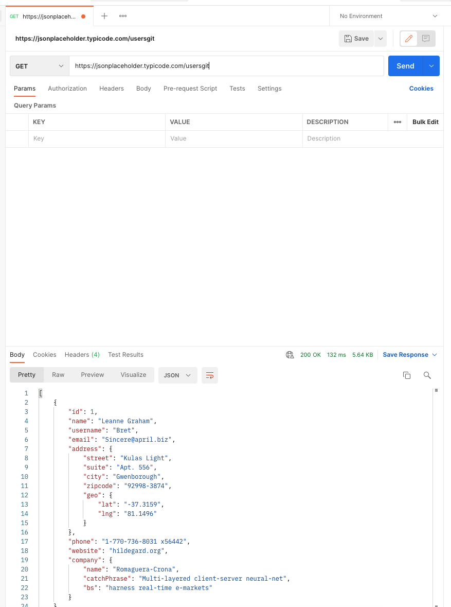

# Ksense API Test App

## Deployed App Link: https://

### Postman Image:

## GitHub Repo: https://github.com/ak89mkii/ksense-api-test

## Notes:
### Directions:
- Using jQuery or vanilla JS you will display each 'USER' in a table.
- When the user selects a 'USER' in the table, it will display all of the 'POSTS' that were created by that 'USER'. 
- You have full freedom in how you accomplish the above objectives.
- You also have full freedom as far as design is concerned.

### Job Description Page Link: https://www.indeed.com/viewjob?from=appsharedroid&jk=c1387af2d6e6a1be

